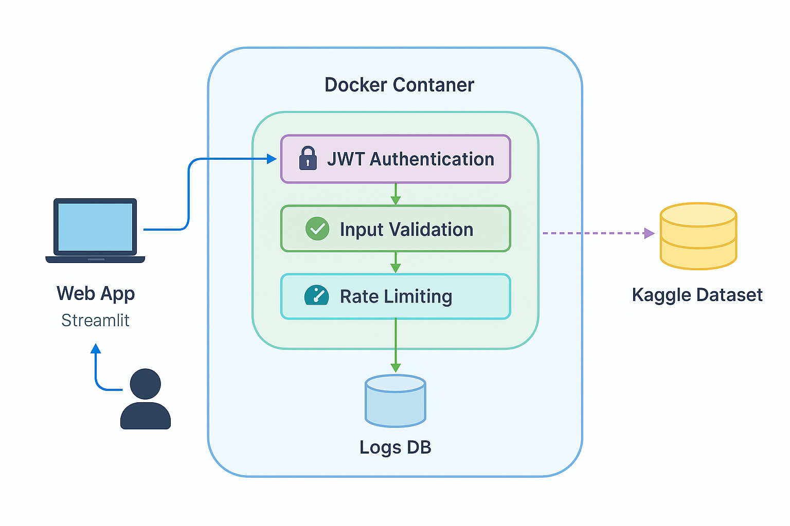
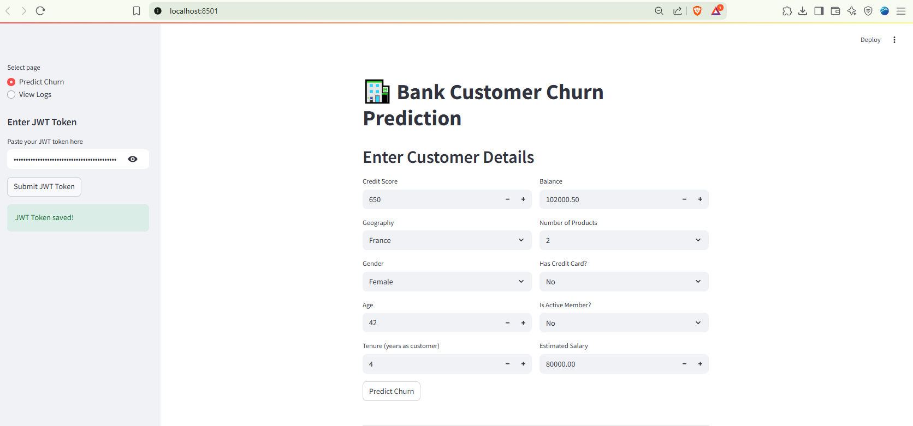
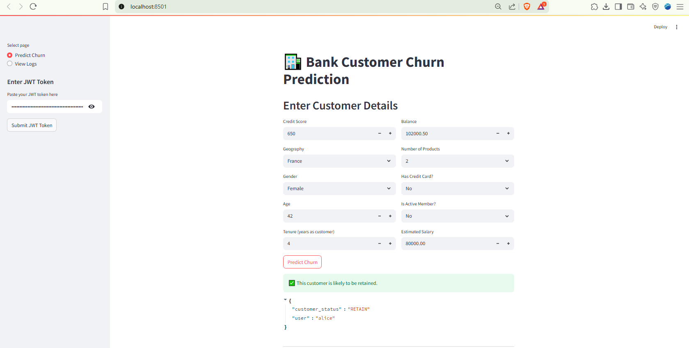
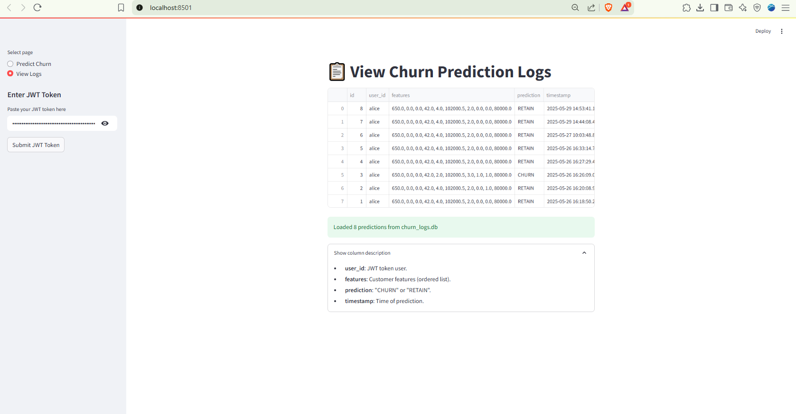

This project provides an end-to-end solution for predicting customer churn in a bank using a machine learning model, a secure FastAPI backend, a Streamlit UI, and persistent logging of all prediction requests.

---

## 🚀 Features

- **FastAPI** REST API for secure churn predictions (JWT-protected)
- **Random Forest** ML model trained on Kaggle Bank Churn dataset
- **Streamlit Dashboard** for interactive predictions and viewing logs
- **Database logging** with SQLite + SQLAlchemy: every prediction request/response is recorded

---

## 📁 Folder Structure

```
bank-churn-api/
│
├── app/
│   ├── __init__.py
│   ├── main.py
│   ├── model.py
│   ├── predict.py
│   ├── validation.py
│   ├── jwt.py
│   ├── rate_limit.py
│   └── db.py
│
├── data/
│   └── Churn_Modelling.csv
│
├── streamlit_app.py
├── requirements.txt
├── Dockerfile
├── entrypoint.sh
├── docker-compose.yml
├── README.md
└── .env
```

## 📊 Project Visuals

### System Flow Diagram



### Streamlit Dashboard Pages

**Page 1:**  


**Page 2:**  


**Page 3:**  


**Page 4:**  


---

## 1️⃣ Setup Instructions

### **A. Download Dataset**

1. Download [`Churn_Modelling.csv` from Kaggle](https://www.kaggle.com/datasets/adammaus/predicting-churn-for-bank-customers).
2. Place it in the `data/` directory.

---

### **B. Install Requirements**

From your project root, run:

```bash
pip install -r requirements.txt
```

---

### **C. Train the Model**

```bash
python app/model.py
```

---

### **D. Run the API and Dashboard**

- **Create JWT token:**

    ```bash
    python -c "from app.jwt import create_token; print(create_token('alice'))"
    ```

- **Start FastAPI server:**

    ```bash
    uvicorn app.main:app --reload
    ```

- **Start Streamlit dashboard:**

    ```bash
    streamlit run streamlit_app.py
    ```

---

### **E. Docker Execution Steps**

- **Generate secret to paste in `.env`:**

    ```python
    import secrets
    print(secrets.token_urlsafe(32))
    ```

- **Generate JWT token inside Docker container:**

    1. Get container ID:

        ```bash
        docker ps
        ```

    2. Enter container shell:

        ```bash
        docker-compose down
        docker-compose build
        docker-compose up -d
        docker exec -it <fastapi_container_id> bash
        ```

    3. Generate token:

        ```bash
        python3 -c "from app.jwt import create_token; print(create_token('alice'))"
        ```

---